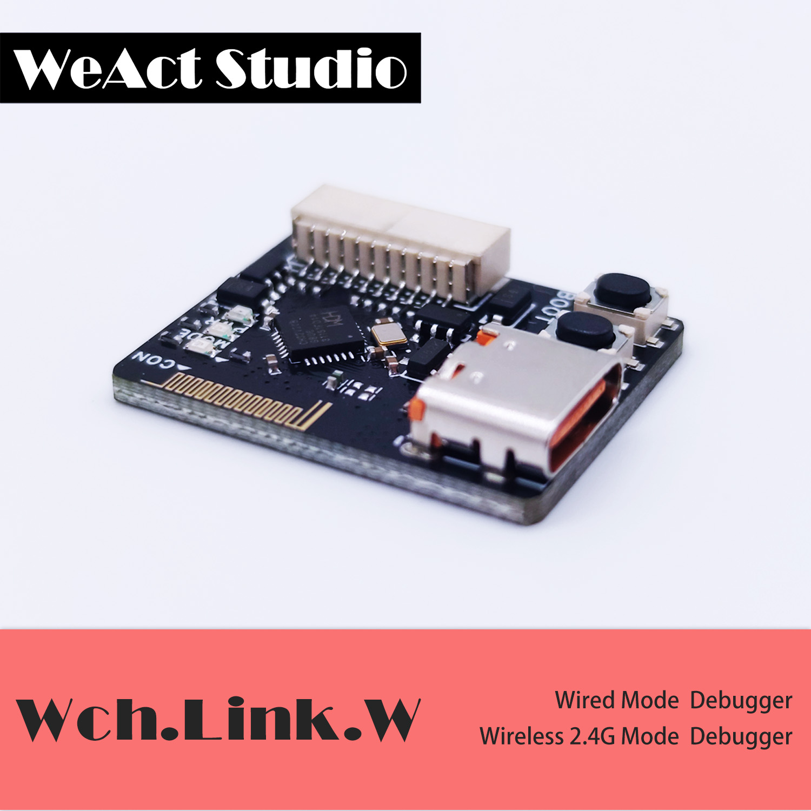
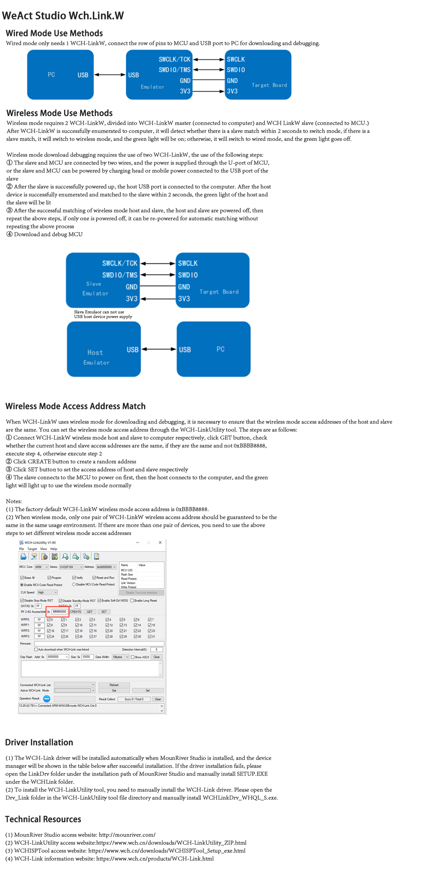

WCHISPTool_Setup ---------- 用于下载单片机程序以及更新WCHlink.W的固件（Used to download microcontroller programs and update firmware for WCHlink.W）
WCH-LinkUtility --------------用于设置无线模式的ID以及更改WCHlink.W的模式（Used to set the ID of the wireless mode and change the mode of the WCHlink.W）

(1) MounRiver Studio access website: [http://mounriver.com/](http://mounriver.com/) 

(2) WCH-LinkUtility access website:https://[www.wch.cn/downloads/WCH-LinkUtility_ZIP.html](http://www.wch.cn/downloads/WCH-LinkUtility_ZIP.html) 

(3) WCHISPTool access website: [WCHISPTool_Setup.exe - 南京沁恒微电子股份有限公司](https://www.wch.cn/downloads/WCHISPTool_Setup_exe.html) 

(4) WCH-Link information website: [产品中心 - 南京沁恒微电子股份有限公司](https://www.wch.cn/products/WCH-Link.html)
